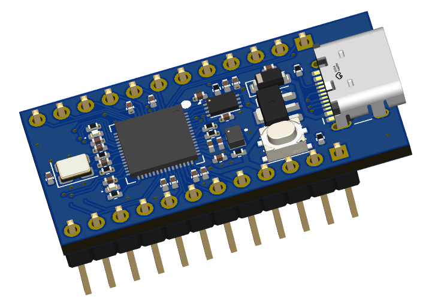
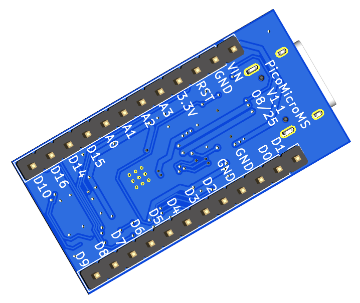
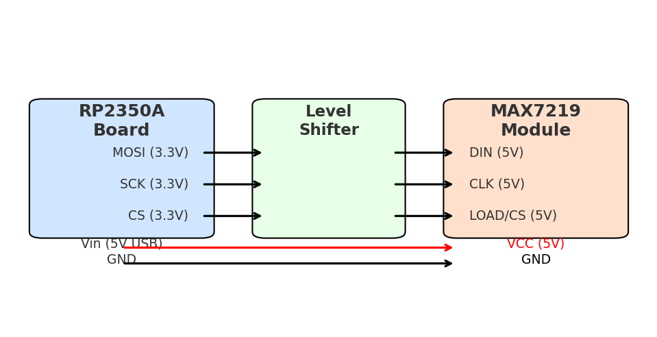

# PicoMicro Board

## Board overview
The PicoMicro Board is a small processor board using the RP2040.
It is intended to replace an Arduino ProMicro or for new designs where the number of pins is sufficient.

### Description of Connectors and parts

## Connecting and wiring

### MobiFlight Prototyping Board

### Direct connection

#### Wiring

#### Board configuration

## MobiFlight Configuration

## Additional information

### Bottom side

### Schematic

---------------------------------------------------------------------------------------------

# ✈️ RP2350A ProMicro-Compatible Board for Mobiflight

This board is designed as a **drop-in replacement** for the classic Arduino Pro Micro (ATmega32U4), but powered by the **modern Raspberry Pi RP2350A microcontroller**.  
It keeps the same **form factor and pinout** while offering massive improvements in performance, memory, and connectivity — making it the **ideal choice for Mobiflight cockpits**.

---

## 🚀 Why RP2350A for Mobiflight?

### ⚡ Drop-In Upgrade
- Identical footprint & pinout to the Arduino Pro Micro  
- Works with existing wiring and PCB layouts → **no hardware redesign required**  

### 📈 Higher Performance for Complex Cockpits
- **Dual-core ARM Cortex-M33 @ up to 150 MHz** (with FPU & DSP)  
- Handles many encoders, switches, LEDs, and displays simultaneously  
- **512 KB SRAM + up to 16 MB Flash** → no memory limits for complex setups  

### 🔌 Richer Connectivity
- **Native USB 2.0 FS/HS** with multiple device classes  
- Multiple **UART, SPI, and I²C buses** for parallel device control  
- **PIO (Programmable I/O)** → accurate timing for LEDs, drivers, or custom protocols  
- Integrated **crypto hardware** (AES, SHA, etc.)  

### ⚡ True 5V Compatibility
- **5V-tolerant I/O pins** → safe with legacy 5V sensors, LEDs, and modules  
- Fully compatible with most cockpit electronics  

---

## ⚠️ Known Limitations vs. Arduino Pro Micro

While this board is highly compatible, there are a few important differences:

1. **Analog Inputs**  
   - Only **A0 to A3** are available (4 total)  
   - Other analog pins present on the Pro Micro are not supported  

2. **5V Output (Pin 21)**  
   - On the Arduino Pro Micro, Pin 21 outputs **5V**  
   - On this board, Pin 21 outputs **3.3V**  

3. **MAX7219 & 5V Requirement**  
   - The MAX7219 driver must still be powered with **5V**  
   - Therefore, an **external 5V source** is required, or you can use **Pin 24 (Vin)**, which provides 5V directly from the USB connector  

4. **Level Shifting for MAX7219**  
   - The MAX7219 requires **5V logic levels**  
   - Use a **level shifter** between the RP2350A board (3.3V signals) and the MAX7219 inputs  

5. **Bootloader Button**  
   - The board includes a **dedicated BOOT button** to enter USB mass storage boot mode (for firmware flashing).  

---

## 📊 RP2350A vs. Arduino Pro Micro (ATmega32U4)

| Feature  | RP2350A ProMicro                          | Arduino Pro Micro (ATmega32U4) |
|----------|-------------------------------------------|--------------------------------|
| MCU      | Dual-core ARM Cortex-M33 @ up to 150 MHz, FPU, DSP | 8-bit AVR @ 16 MHz |
| Flash    | Up to 16 MB QSPI (typ. 2–8 MB onboard)    | 32 KB |
| RAM      | 512 KB                                    | 2.5 KB |
| USB      | Native USB 2.0 FS/HS, multiple device classes | Native USB 2.0 FS (limited) |
| I/O      | **3.3 V logic, 5 V-tolerant pins**        | 5 V I/O (native) |
| Analog   | 4 (A0–A3 only)                            | 12 (depending on variant) |
| Extra HW | 2× PIO, Crypto engine, more UART/SPI/I²C | – |
| Power    | Low-power modes, efficient ARM design     | Limited power saving |

---

### Example Wiring (MAX7219 with External 5V)

When using a MAX7219 with this RP2350A board, note the following:

- The MAX7219 **requires 5V power** for reliable operation.
- The RP2350A board only provides **3.3V logic**, so a **level shifter** is required on the SPI signals.
- Use the `Vin` pin (Pin 24, USB 5V) as the 5V source if no external supply is available.
- Do **not** use Pin 21 (`5V`), as it only provides 3.3V on this board.

#### Wiring Notes

- **Vin (5V USB)** → **VCC (5V MAX7219)**
- **GND** → **GND**
- **MOSI (3.3V)** → (via level shifter) → **DIN (5V)**
- **SCK (3.3V)** → (via level shifter) → **CLK (5V)**
- **CS (3.3V)** → (via level shifter) → **LOAD/CS (5V)**

Make sure to add a **3.3V → 5V level shifter** on the SPI signals to the MAX7219.

#### Block Diagram

### Quick Pin Behavior (differences vs. classic Pro Micro)

| Function           | Pin (Pro Micro name) | This Board (RP2350A)          |
|-------------------|----------------------|--------------------------------|
| 5 V rail          | **Pin 21 (Vcc 5V)**  | **3.3 V output**               |
| VIN (USB 5 V)     | **Pin 24 (RAW/VIN)** | **5 V from USB passthrough**   |
| Analog inputs     | **A0…A3**            | **A0…A3 only**                 |
| I/O levels (out)  | —                    | **3.3 V**                      |
| I/O tolerance (in)| —                    | **5 V-tolerant inputs**        |

> Tip: Devices that *require* 5 V logic (e.g., MAX7219) need **5 V power (VIN)** and **level shifting** on data/clock/chip-select.

---

## 📊 RP2350A vs. Arduino Pro Micro (ATmega32U4)

| Feature  | RP2350A ProMicro                          | Arduino Pro Micro (ATmega32U4) |
|----------|-------------------------------------------|--------------------------------|
| MCU      | Dual-core ARM Cortex-M33 @ up to 150 MHz, FPU, DSP | 8-bit AVR @ 16 MHz |
| Flash    | Up to 16 MB QSPI (typ. 2–8 MB onboard)    | 32 KB |
| RAM      | 512 KB                                    | 2.5 KB |
| USB      | Native USB 2.0 FS/HS, multiple device classes | Native USB 2.0 FS (limited) |
| I/O      | **3.3 V outputs, 5 V-tolerant inputs**    | 5 V I/O (native) |
| Analog   | **A0…A3 only**                            | A0…A11 (board-dependent) |
| Power    | 3.3 V rail on “5V” pin; **5 V on VIN**    | 5 V rail; RAW/VIN to regulator |

---

## ✈️ Why It Matters for Mobiflight
- **Supports more devices per board** → fewer boards, fewer USB connections  
- **Fast response times** → smoother input/output handling with no lag  
- **Drop-in mechanics** → works in place of the Pro Micro in your cockpit modules  
- **Future-ready** → while the ATmega32U4 reaches its limits, the RP2350A provides plenty of headroom for upcoming Mobiflight features  

---

## 🛠 Software Support
- Fully **Arduino IDE compatible** (just like the Pro Micro)  
- Also supports **MicroPython, CircuitPython, and C/C++ SDK** (for developers extending beyond Mobiflight)

---

## 📌 Summary
The **RP2350A ProMicro** is a **next-generation upgrade** built for Mobiflight cockpit builders:  
✅ More performance & memory  
✅ 5 V-tolerant inputs (3.3 V outputs)  
✅ Clear guidance for 5 V devices (MAX7219)  
✅ 100% ProMicro mechanics, with documented electrical differences

> **Upgrade your cockpit today — with transparent compatibility notes for a smooth migration.**
